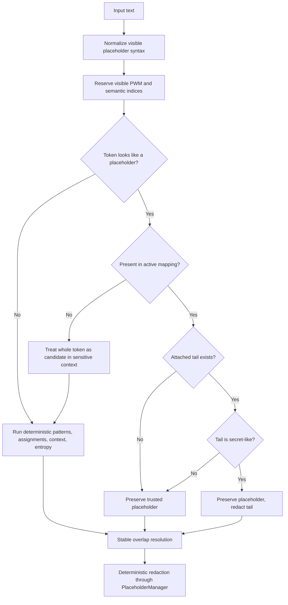
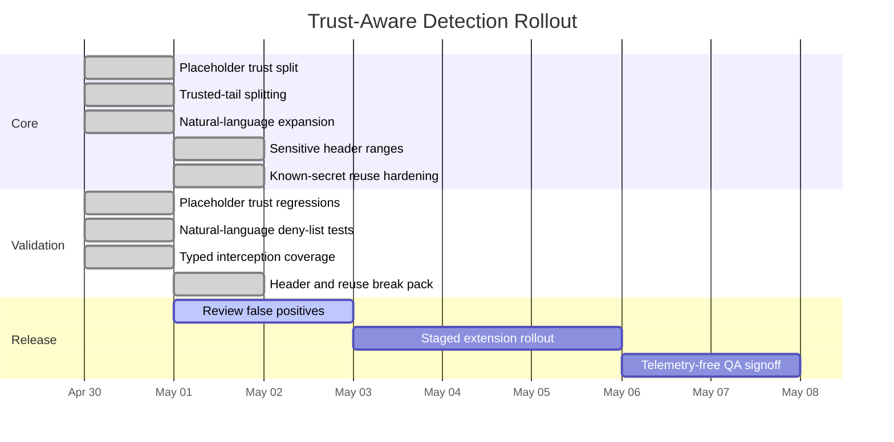

# Detection Enhancements

## Trust-Aware Placeholders

LeakGuard now treats placeholder syntax and placeholder trust as separate signals.
Visible tokens such as `[PWM_7]`, `[PASSWORD_2]`, and `[TOKEN_1]` reserve their visible PWM index space where applicable, but they are only preserved when the active session mapping knows them. This closes placeholder laundering while keeping deterministic placeholder numbering stable.

Trusted placeholders are sourced from the active `PlaceholderManager` state or a sanitized trusted placeholder list. Unknown placeholder-like tokens in sensitive contexts are scanned as secret candidates. If a trusted placeholder is followed by a secret-like tail, LeakGuard preserves the placeholder and redacts only the tail.



## Natural-Language Disclosures

Natural-language detection now covers broader chat-style disclosures:

- `this is my secret ...`
- `here is my password ...`
- `my db password is ...`
- `real value: ...`
- `token -> ...`
- `again same key: ...`
- `same token: ...`

The deny list suppresses benign discussion around examples, templates, password policy, regex help, validators, generators, and safe configuration keys such as `password_hint`, `secret_santa`, `token_limit`, `api_version`, `build_id`, `region`, and `environment`.

## Sensitive HTTP Headers

v1.3.0 adds a narrow allowlist for sensitive HTTP header names:

- `Authorization`
- `X-API-Key` / `API-Key`
- `X-Auth-Token`, `X-Access-Token`, `X-Session-Token`
- `Ocp-Apim-Subscription-Key`
- `Cookie` and `Set-Cookie`

The detector preserves header names, separators, and auth schemes while redacting the intended secret value range. For example, `Authorization: Bearer BearerToken123` becomes `Authorization: Bearer [PWM_N]`, and `X-API-Key: ApiKeyHeader123` becomes `X-API-Key: [PWM_N]`.

Safe headers such as `Content-Type`, `Accept`, `User-Agent`, `Cache-Control`, `X-Request-ID`, and `X-Trace-ID` remain unchanged.

## Known-Secret Reuse

Redaction now prefers full known raw secret reuse over shorter suffix-only findings. If a secret first appears in a structured context and later appears in labelled prose, the later occurrence reuses the original placeholder:

```text
X-API-Key: ApiKeyHeader1234567890
Again same key: ApiKeyHeader1234567890
```

becomes:

```text
X-API-Key: [PWM_N]
Again same key: [PWM_N]
```

This keeps placeholder reuse stable and prevents partial outputs such as `ApiKey[PWM_N]`.

## Rollout Timeline


