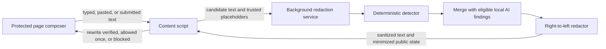
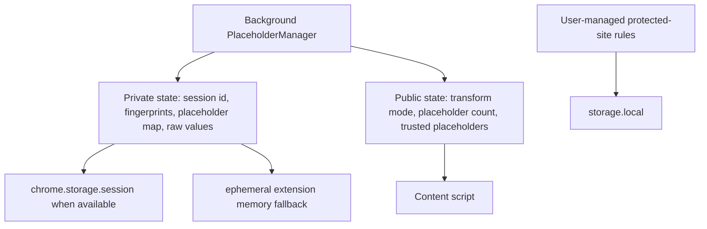
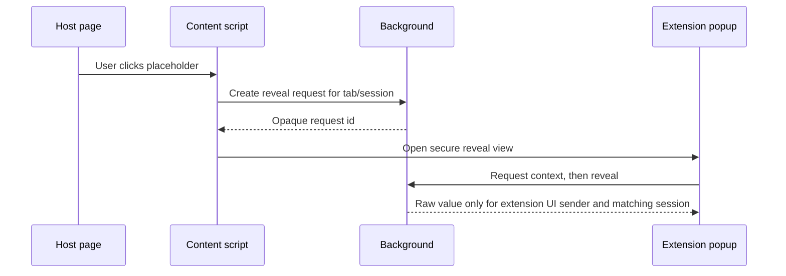
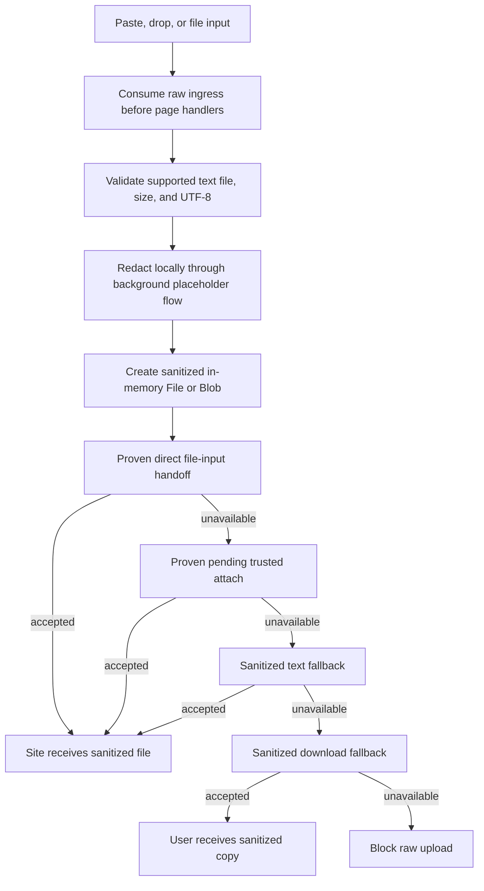
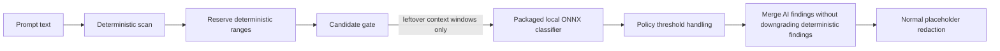

# LeakGuard Threat Model

Status: engineering reference for the current implementation. This document is not release, store, legal, or compliance copy.

Related docs:

- [SECURITY_REVIEW.md](../SECURITY_REVIEW.md)
- [NON_GOALS.md](NON_GOALS.md)
- [IMPLEMENTATION_ROADMAP.md](IMPLEMENTATION_ROADMAP.md)
- [PLACEHOLDERS_AND_REVEAL.md](PLACEHOLDERS_AND_REVEAL.md)
- [file-handoff-architecture.md](file-handoff-architecture.md)
- [AI_ASSIST.md](AI_ASSIST.md)
- [MANAGED_POLICY_SCHEMA.md](MANAGED_POLICY_SCHEMA.md)

## Scope

This model covers LeakGuard's current browser-extension behavior for:

- protected composer text typed, pasted, or submitted on supported sites
- supported UTF-8 text/source files, text PDF extraction, DOCX text extraction, XLSX text extraction, image metadata, scanner OCR, and protected composer file-ingress paths
- placeholder/session state and secure reveal
- optional local AI assist over candidate windows
- enterprise managed policy and metadata-only audit events

It does not expand product scope. LeakGuard remains a local risk-reduction tool, not full DLP, not a credential lifecycle system, not remote verification, and not protection for every site, editor, browser path, file type, screenshot, clipboard history, malware, hostile extension, compromised browser, or operating-system exposure path.

## Assets

| Asset | Protection goal |
| --- | --- |
| Raw prompt text | Process locally and avoid intentional persistence or logging. |
| Raw secrets, emails, public IPv4 hosts, and public IPv4 ranges | Replace with placeholders before protected submission unless the user or policy allows otherwise. |
| Supported local text-file contents and chunks | Read only after user selection, paste, or drop; redact locally; avoid raw upload after LeakGuard attempts sanitization. |
| Supported document extracted text | Extract text from PDF, DOCX, and XLSX locally; redact before `.redacted.txt` export or handoff; do not rebuild original formats yet. |
| Image metadata, OCR text, and image bytes | Process locally for metadata, scanner OCR, and opt-in protected-site OCR; avoid persistence, logging, remote OCR, and raw image upload after LeakGuard attempts sanitization. |
| Placeholder private state | Keep raw mappings background-owned and session-scoped for reveal only. |
| Public placeholder state | Expose only safe state needed by content scripts, such as placeholder counts and trusted placeholder tokens. |
| Secure reveal requests | Use opaque ids and session binding; return raw values only to extension-owned UI. |
| Extension UI documents | Keep reveal, popup, scanner, and options inside extension pages with restrictive CSP and packaged scripts. |
| User-managed protected-site rules | Persist normalized site rules without storing raw prompt or file contents. |
| Managed policy | Enforce local policy choices without claiming browser-level force install or removal prevention. |
| Enterprise audit events | Store bounded metadata only, excluding raw prompts, raw secrets, selected file contents, and full URLs. |
| Packaged AI model and ONNX runtime assets | Load from extension package only; do not send candidate text to remote services. |

## Trust Boundaries

| Boundary | Trusted side | Untrusted or less-trusted side | Expected control |
| --- | --- | --- | --- |
| Page DOM to content script | Extension isolated content logic | Host page DOM, scripts, editor state, upload controls | Consume sensitive events early, rewrite or block before protected send, never reveal raw values into page DOM. |
| Content script to background | Background redaction and session service | Content script public state and page-observed effects | Keep private mappings background-owned; return sanitized output and minimized public state. |
| Background to extension UI | Popup/scanner/options extension pages | Any content-script or page sender | Verify extension UI sender before returning raw reveal values. |
| Session storage to local storage | `chrome.storage.session` or ephemeral memory for private mappings | Persistent `storage.local` for user site rules | Never fall back to persistent local storage for raw placeholder/reveal mappings. |
| Local file API to site upload | Sanitized in-memory `File` or `Blob` | Raw local file object and host upload pipeline | Block raw ingress first for supported files; hand off only sanitized files where safe. |
| Local OCR runtime to scanner/protected-site flow | Packaged OCR worker/assets and image redactor | Raw image bytes and OCR text | English-only local OCR; no remote OCR/backend; protected-site OCR default off and `.redacted.png` only when boxes are eligible. |
| AI assist candidate gate to classifier | Packaged local ONNX classifier | Full prompt and deterministic finding ranges | Send only leftover candidate windows; never use remote model calls. |
| Managed policy/audit to admin review | Policy values and metadata-only audit records | Raw prompts, raw secrets, file contents, full URLs | Keep audit bounded and raw-free; avoid compliance or SIEM claims. |

## Hostile Page Assumptions

LeakGuard assumes protected pages can be actively hostile or simply unstable:

- The page can read and mutate its own DOM, composer text, attributes, upload inputs, drag/drop handlers, and page-visible events.
- The page can observe that placeholders appear in the composer and that a user clicked a placeholder.
- The page can receive and inspect sanitized text or sanitized files after LeakGuard deliberately hands them off.
- The page can change editor implementations, hidden upload controls, trusted user activation requirements, or event ordering.
- The page cannot read extension-owned popup/scanner/options DOM, extension session storage, or background private state unless the browser or extension platform is compromised.

Controls from this model:

- Raw reveal never writes back into host DOM.
- Page-visible labels stay neutral and do not include secret classifications or masked raw fragments.
- Rewrite verification fails closed for high-confidence raw leftovers.
- File handoff adapters must be proven before enabling pending attach or synthetic handoff paths.

## Extension UI Trust

Extension UI is trusted relative to web pages, but it still has strict boundaries:

- Extension pages use packaged scripts and the restrictive extension-page CSP.
- Secure reveal is popup-only and requires a user action to show the raw value.
- Reveal requests use opaque ids and session checks.
- Unknown placeholders report unavailable instead of causing raw text injection.
- Scanner exports are explicit user actions; sanitized JSON reports omit raw findings by default.

Future UI changes that add inline scripts, `eval`, relaxed CSP, page-accessible reveal resources, raw values in URLs, or framed extension pages require explicit security review.

## Session Storage And Ephemeral Fallback

Private placeholder and reveal state prefers `chrome.storage.session` so service-worker restarts can preserve reveal for the active browser session. If session storage is unavailable, LeakGuard uses ephemeral extension memory instead of `storage.local`.

Current residual risks:

- Raw values still exist transiently in content and background memory while local detection and redaction run.
- Raw reveal mappings remain available inside private extension session state while reveal is possible.
- A browser compromise, malicious extension with sufficient privileges, or local malware can break this trust model.

## File Handoff Trust Boundaries

Supported local file ingress is treated as high risk because the host page may try to read file contents immediately.

Rules:

- Consume supported paste/drop/file-input events before page handlers can use the raw file.
- Validate supported file type, size, UTF-8 text, extracted document text, image metadata, or OCR/image bounds locally.
- Redact through the background-owned placeholder flow.
- Create sanitized in-memory `File` or `Blob` objects.
- Export scanner text PDFs as `.redacted.txt` plus regenerated `.redacted.pdf` from sanitized text only. Export protected-site text PDFs as regenerated `.redacted.pdf` only when complete, with `.redacted.txt` fallback when regeneration would truncate. Export DOCX, XLSX, image metadata, and OCR text as `.redacted.txt`; do not claim layout-preserving or rebuilt DOCX/XLSX originals.
- Export scanner or eligible protected-site visual image redaction as flattened `.redacted.png` only.
- Keep protected-site OCR opt-in and default off.
- Prefer proven direct file-input assignment.
- Use pending trusted attach only for adapters with focused evidence and tests.
- Fall back to sanitized text or sanitized download when safe.
- Block raw upload after LeakGuard attempts sanitization and no safe handoff remains.

Unsupported files are not represented as scanned, protected, or sanitized. They receive honest warnings and either pass through where that path is safe or are blocked where LeakGuard cannot safely replay or pass through the original browser/site event.

Current document/image limits:

- no scanned-PDF OCR
- no non-English OCR
- no remote OCR, backend file processing, telemetry, or remote model calls
- no image format preservation for visual redaction
- no PDF/DOCX/XLSX rebuilt outputs

## AI Assist Boundaries

AI assist is local and optional. Deterministic detection remains authoritative.

Rules:

- Do not send full prompts to AI assist.
- Do not send deterministic finding ranges to AI assist.
- Extract only leftover suspicious candidate windows.
- Load the packaged ONNX model and runtime assets from extension URLs.
- Do not make network calls, remote model calls, cloud scans, or remote verification requests.
- AI assist may add suspicious findings; it cannot downgrade deterministic findings.

## Enterprise Audit Metadata Boundaries

Enterprise audit mode is metadata-only:

- no raw prompts
- no raw secrets
- no selected file contents
- no full URLs
- bounded retention through `auditRetentionDays`
- `full` audit mode normalizes to metadata-only for safety

This is not SIEM integration, compliance certification, or proof of complete DLP coverage. Browser policy is still required for force install, extension removal prevention, incognito/InPrivate controls, and developer-mode restrictions.

## Prompt Redaction

Invariant: raw text is processed locally. Sanitized text and placeholders are page-visible; raw reveal values are not.

## Placeholder And Session State

Invariant: raw placeholder mappings never intentionally move into persistent local storage or page-owned DOM.

## Secure Reveal

Invariant: the page can observe a placeholder click, but raw text renders only in extension-owned UI.

## File Handoff

Invariant: after LeakGuard attempts sanitization for a supported text file, raw upload must not be the fallback.

## AI Candidate Gate

Invariant: local AI assist receives only candidate context windows and never becomes a full-prompt remote classifier.

## Security Test Mapping

| Invariant | Existing checks |
| --- | --- |
| Raw reveal is popup-only and content scripts cannot request raw placeholders for page rendering. | [tests/security.test.js](../tests/security.test.js) |
| Extension-page CSP stays restrictive and reveal UI is not web-accessible to pages. | [tests/security.test.js](../tests/security.test.js), [tests/build_targets.test.js](../tests/build_targets.test.js) |
| Session storage fallback is ephemeral and does not persist private placeholder state in `storage.local`. | [tests/security.test.js](../tests/security.test.js) |
| Public state crossing to content scripts is minimized. | [tests/security.test.js](../tests/security.test.js) |
| Metadata-only audit events exclude raw secrets and full URLs and enforce retention. | [tests/security.test.js](../tests/security.test.js), [tests/enterprise_policy.test.js](../tests/enterprise_policy.test.js) |
| Trusted placeholders pass through while unknown placeholder-like secrets are handled safely. | [tests/placeholder_trust.test.js](../tests/placeholder_trust.test.js), [tests/typed_interception.test.js](../tests/typed_interception.test.js) |
| Sensitive headers, URL credentials, repeated secrets, and public IPv4 values keep safe placeholder behavior. | [tests/break_pack.test.js](../tests/break_pack.test.js), [tests/ip_transform.test.js](../tests/ip_transform.test.js), [tests/ip_child_first_audit.test.js](../tests/ip_child_first_audit.test.js) |
| Local text files are validated, decoded, redacted, and handed off without scanner placeholder isolation leaking into prompt reveal state. | [tests/file_scanner.test.js](../tests/file_scanner.test.js), [tests/file_paste_helpers.test.js](../tests/file_paste_helpers.test.js), [tests/content_file_drop_interception.test.js](../tests/content_file_drop_interception.test.js) |
| PDF, DOCX, XLSX, image metadata, scanner OCR, protected-site OCR opt-in, eligible `.redacted.png`, failure blocking, and raw cache/report safety stay scoped. | [tests/file_extractors.test.js](../tests/file_extractors.test.js), [tests/content_file_extraction_pipeline.test.js](../tests/content_file_extraction_pipeline.test.js), [tests/scanner_ocr.test.js](../tests/scanner_ocr.test.js) |
| Streaming file redaction handles chunk boundaries, repeated placeholders, invalid UTF-8, and over-limit blocking. | [tests/streaming_file_redactor.test.js](../tests/streaming_file_redactor.test.js), [tests/content_file_drop_interception.test.js](../tests/content_file_drop_interception.test.js) |
| Pending file attach remains gated to proven adapters and cleans up memory-only state. | [tests/content_file_drop_interception.test.js](../tests/content_file_drop_interception.test.js) |
| AI assist uses candidate windows, ignores deterministic ranges and placeholders, stays policy-controlled, and uses packaged local runtime assets. | [tests/ai_candidate_gate.test.js](../tests/ai_candidate_gate.test.js), [tests/transform_with_ai.test.js](../tests/transform_with_ai.test.js), [tests/ai_assist.test.js](../tests/ai_assist.test.js) |
| Build targets preserve manifest shape, Firefox data collection declaration, enterprise defaults, packaged AI runtime resources, and release artifact sanitization. | [tests/build_targets.test.js](../tests/build_targets.test.js) |
| Productization docs and UI wiring continue to describe local-only handling, session storage, ephemeral fallback, audit retention, and minimal permissions. | [tests/productization.test.js](../tests/productization.test.js) |

## Residual Risks

- Detection is best-effort and can miss or misclassify sensitive text.
- Raw text exists transiently in browser memory during local processing.
- Raw reveal values remain in private session state while reveal is available.
- Host pages can change UI, upload controls, and event ordering in ways that require adapter updates.
- Unsupported file formats and unsupported OCR/document rebuild cases are not scanned, rebuilt, or redacted in this release.
- Manual QA and human legal/product review remain required before publication.
- Browser policy guidance and store requirements can change and must be rechecked immediately before submission.
