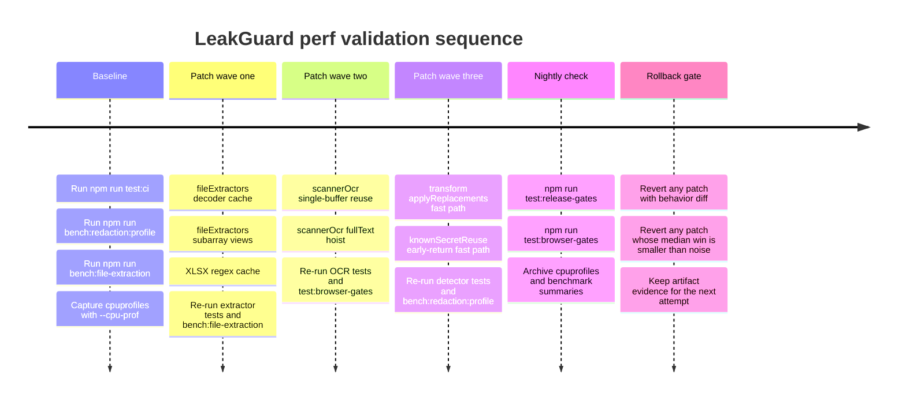

# LeakGuard Minimal Low-Risk Performance Optimization Report

## Executive Summary

LeakGuard already has a stronger performance-safety foundation than most extensions: the repo contains a redaction benchmark with stage and detector-method breakdowns, a file-extraction benchmark wired into release gates, a non-flaky benchmark-policy test that checks coverage markers instead of hard-failing on noisy timings, and separate CI, release, and browser-gate scripts in `package.json`. That means the safest next step is not broad refactoring. It is a short sequence of allocation-reduction changes in the hot paths that are already covered by deterministic tests and benchmark scripts. citeturn47view4turn39view0turn46view0turn46view1turn46view2

The highest-value low-risk opportunities are concentrated in `src/shared/fileExtractors.js`, not in detector logic. The extractor path still creates a fresh `TextDecoder` per call, copies ZIP entry bytes with `slice()`, recompiles regular expressions in XLSX parsing loops, and materializes entire arrays of decoded PDF streams before joining them. OCR has a smaller but still worthwhile inefficiency: when image dimensions are probed, `scannerOcr.js` reads the file into memory once for dimensions and again for OCR bytes, and it repeatedly coerces `text` to `String(...)` inside word/line loops. Detector-adjacent code still has a few small wins left, but those are now second-order compared with file extraction and OCR allocation churn. citeturn21view1turn24view1turn25view0turn25view1turn22view1turn29view0

My recommendation is to land changes in this order: first, `subarray()` plus decoder caching in `fileExtractors.js`; second, XLSX regex caching; third, OCR single-buffer reuse; fourth, removal of redundant replacement sorting in transform paths; fifth, only then, a more careful PDF single-pass extraction pass. I would explicitly avoid changing detector rules, adapters, permissions, OCR product scope, or adding multi-worker OCR scheduling. Tesseract’s own docs say schedulers mainly help when running multiple jobs in parallel, and that single-file performance is similar; LeakGuard’s OCR strategy is deliberately single-extension, local-only, and scoped to scanner/protected-site flows, while the runtime already uses a worker-backed recognition path with explicit termination semantics. citeturn45search0turn45search5turn40view0turn43view4

## What the repository already tells us

The `src/shared` directory is where the meaningful performance work lives. It contains `detector.js`, `fileExtractors.js`, `scannerOcr.js`, `streamingFileRedactor.js`, `transformOutboundPrompt.js`, `knownSecretReuse.js`, and the PDF/DOCX/XLSX redactors. That is a good sign, because the public hot paths are centralized and already isolated behind tests. citeturn19view0

The redaction benchmark is already designed to be useful for optimization work. It has explicit profile mode via `LEAKGUARD_BENCH_PROFILE=1`, defaults to eight iterations with a floor of three, labels timing rows as advisory unless profile mode is intentionally enabled, and exposes stage totals such as `scan_ms`, `transform_ms`, `known_secret_collect_ms`, `replacement_sort_ms`, and a detector-method table. The sample set also includes a large safe-text guard (`long_safe_logs_120kb`) to catch false positives and performance regressions on benign content. citeturn47view0turn47view1turn47view4

The repo also already encodes the right anti-flake policy. The flake-policy test checks for sample coverage markers like `overlap-correctness`, `repeated-env-like-secrets`, `safe-text-no-false-positives`, and `known-secret-reuse`, rather than forcing hard wall-clock thresholds in ordinary test flow. That is exactly the correct pattern for performance regression detection in shared CI: keep correctness and coverage strict, keep timing assertions advisory or limited to stable runners. citeturn39view0turn39view1turn39view2turn39view3

The release and browser pipeline is also already optimized for staged validation. `bench:file-extraction` runs in `test:release-gates`, while browser smoke and QA are grouped in `test:browser-gates`, and redaction profiling already has a dedicated `bench:redaction:profile` convenience script. That makes it practical to validate extractor and OCR speedups without weakening the PR-safe test tier. citeturn46view1turn46view2turn46view4

## Priority-ranked micro-optimizations

The table below is ordered by the combination of expected benefit, implementation simplicity, and risk of behavior drift.

| Priority | Candidate | Why it is implementable now | Estimated gain | Risk | Files touched | Tests to run |
|---|---|---|---|---|---|---|
| P1 | Cache one UTF-8 `TextDecoder` and replace ZIP-entry `slice()` copies with `subarray()` views | `decodeUtf8Bytes()` creates a fresh decoder per call, and `parseZipEntries()` copies both entry names and compressed payloads eagerly; those allocations happen for every DOCX/XLSX entry. citeturn22view0turn24view1turn24view2 | **5–15%** on large DOCX/XLSX extraction, plus lower peak RSS | Low | `src/shared/fileExtractors.js` (`decodeUtf8Bytes()`, `parseZipEntries()`) | `node tests/file_extractors.test.js`, `node tests/docx_redactor.test.js`, `node tests/xlsx_redactor.test.js`, `npm run bench:file-extraction` |
| P1 | Cache dynamically built XLSX regexes by tag/attribute | `extractXmlTextValues()` and `getCellAttribute()` build new `RegExp` objects repeatedly inside workbook parsing loops. citeturn25view0turn25view1turn25view4 | **5–12%** on sheet-heavy XLSX files | Low | `src/shared/fileExtractors.js` (`extractXmlTextValues()`, `getCellAttribute()`, `extractTextFromXlsxWorksheetXml()`) | `node tests/file_extractors.test.js`, `node tests/xlsx_redactor.test.js`, `npm run bench:file-extraction` |
| P2 | Reuse one image buffer in OCR when dimensions are probed, and hoist `fullText` out of OCR layout loops | `readImageDimensions()` reads the file buffer, then `recognizeScannerImageFile()` reads the file again; `sanitizeOcrLayout()` repeatedly evaluates `String(text || "")` inside loops. citeturn29view0 | **5–10%** on medium/large image OCR paths, with less GC churn | Low | `src/shared/scannerOcr.js` (`readImageDimensions()`, `recognizeScannerImageFile()`, `sanitizeOcrLayout()`) | OCR unit tests, scanner/browser smoke, `npm run test:browser-gates` |
| P2 | Remove redundant sort work in replacement application | `transformOutboundPrompt()` sorts `replacements` before calling `applyReplacements()`, and `applyReplacements()` sorts again; the streaming redactor performs a similar sort-before-apply pattern. citeturn33view0turn33view1 | **2–6%** on long prompt transforms or large streaming text segments | Low | `src/shared/transformOutboundPrompt.js`, optionally `src/shared/streamingFileRedactor.js` | `node tests/detector.test.js`, transform/streaming tests, `npm test`, `npm run bench:redaction:profile` |
| P3 | Add fast exits in known-secret reuse when there is nothing to scan | `collectKnownSecretReplacements()` always builds regex/index state even if `manager.getKnownSecretEntries()` returns none or `text` is too short to matter. citeturn27view1 | **1–3%** on common safe-text paths with zero known-secret entries | Low | `src/shared/knownSecretReuse.js` | `node tests/detector.test.js`, `npm run bench:redaction:profile` |
| P3 | Rewrite PDF extraction from array-heavy multi-pass to single-pass accumulation with early cut-off | `extractPdfText()` currently does `Promise.all(...map(...))`, then another `map`, `filter`, `join`, and only then size validation. citeturn22view1turn23view0 | **5–12%** wall time and **10–20%** lower peak memory on stream-heavy PDFs | Medium | `src/shared/fileExtractors.js` (`extractPdfText()`) | `node tests/file_extractors.test.js`, `node tests/pdf_redactor.test.js`, `npm run bench:file-extraction` |
| P4 | Replace char-by-char `decodePdfByteString()` with chunked conversion | `decodePdfByteString()` concatenates one character at a time, which is a classic allocation-heavy pattern on large buffers. citeturn21view1turn21view3 | **5–15%** on PDF byte decoding | Medium | `src/shared/fileExtractors.js` (`decodePdfByteString()`) | `node tests/file_extractors.test.js`, `node tests/pdf_redactor.test.js`, `npm run bench:file-extraction` |

The highest-confidence changes are the first four. They do not alter detector rules, do not change OCR scope, and do not change external interfaces. They mainly remove redundant object creation and byte copying in code that already has deterministic tests and benchmark coverage. citeturn39view0turn46view1

The fifth and sixth items are still reasonable, but they should be treated as “profile-confirmed” changes rather than “apply immediately” changes. The repo’s redaction benchmark already prints detector-method averages and transform-stage timings, so there is no reason to speculate if the profile says otherwise. Run the profile first; if `replacement_sort_ms`, `known_secret_collect_ms`, `extractPdfText()`, or PDF decode dominate, then land the next candidate. If they do not, stop. citeturn47view4turn44search0turn44search1turn44search20

### Patch sketches for the safest changes

A minimal extractor patch can combine the two best wins in one place:

```js
// src/shared/fileExtractors.js
const UTF8_DECODER = new TextDecoder("utf-8", { fatal: false });

function decodeUtf8Bytes(bytes) {
  return UTF8_DECODER.decode(bytes);
}

async function parseZipEntries(buffer) {
  const bytes = toUint8Array(buffer);
  // ...
  const name = decodeUtf8Bytes(bytes.subarray(nameStart, nameEnd)).replace(/\\/g, "/");
  entries.push({
    name,
    flags,
    method,
    compressedSize,
    uncompressedSize,
    compressedBytes: bytes.subarray(dataStart, dataEnd)
  });
}
```

That keeps semantics the same while eliminating a decoder allocation and two copying `slice()` calls in the ZIP-entry path. The reason this is attractive is visible directly in the current implementation: `decodeUtf8Bytes()` instantiates a new decoder, and `parseZipEntries()` eagerly copies entry name bytes and compressed data bytes. citeturn22view0turn24view1turn24view2

A minimal XLSX regex-cache patch is similarly straightforward:

```js
// src/shared/fileExtractors.js
const xmlTagPatternCache = new Map();
const attrPatternCache = new Map();

function getXmlTagPattern(tagName) {
  let pattern = xmlTagPatternCache.get(tagName);
  if (!pattern) {
    const qualifiedTagName = `(?:[A-Za-z_][\\w.-]*:)?${tagName}`;
    pattern = new RegExp(
      `<${qualifiedTagName}\\b[^>]*>([\\s\\S]*?)<\\/${qualifiedTagName}>`,
      "gi"
    );
    xmlTagPatternCache.set(tagName, pattern);
  }
  pattern.lastIndex = 0;
  return pattern;
}

function getCellAttribute(cellXml, attributeName) {
  let pattern = attrPatternCache.get(attributeName);
  if (!pattern) {
    pattern = new RegExp(`\\b${attributeName}=(["'])(.*?)\\1`, "i");
    attrPatternCache.set(attributeName, pattern);
  }
  return cellXml.match(pattern)?.[2] || "";
}
```

This is worth doing because `extractXmlTextValues()` and `getCellAttribute()` rebuild regex objects in the exact inner loops that parse workbook XML, shared strings, and worksheet cells. citeturn25view0turn25view1turn25view3turn25view4

The OCR patch is also clean and low risk:

```js
// src/shared/scannerOcr.js
async function readImageDimensionsFromBuffer(buffer, mimeType) {
  const bitmap = await createImageBitmap(new Blob([buffer], { type: mimeType || "" }));
  try {
    return { width: bitmap.width, height: bitmap.height };
  } finally {
    bitmap.close?.();
  }
}

async function recognizeScannerImageFile(file, options = {}) {
  let buffer = null;
  if (options.readDimensions === true || typeof file?.arrayBuffer === "function") {
    buffer = await file.arrayBuffer();
  }

  const dimensions = options.readDimensions
    ? await readImageDimensionsFromBuffer(buffer, file.type)
    : options.dimensions || null;

  const bytes = toUint8Array(buffer);
  // ...
}

function sanitizeOcrLayout(result, text) {
  const fullText = String(text || "");
  // use fullText.indexOf(...) inside the word/line loops
}
```

That patch is justified because the current code reads the file once in `readImageDimensions()` and again in `recognizeScannerImageFile()`, and the word/line alignment loops repeatedly call `String(text || "")` on every iteration. citeturn29view0

## Benchmarking commands and minimal CI guards

### Recommended benchmark and profiling commands

The repo already ships the right commands for deterministic validation. `bench:redaction:profile` enables profile mode and defaults to twelve iterations, while `bench:file-extraction` is the extractor benchmark used in release gates. Ordinary benchmark rows are intentionally advisory unless profile mode is enabled. citeturn46view1turn47view0

Use this command set for each patch:

```bash
# Baseline correctness
npm run test:ci

# Redaction benchmark, current repo-native profile path
npm run bench:redaction:profile

# Redaction CPU profile artifact
node --cpu-prof --cpu-prof-name=leakguard-redaction.cpuprofile \
  tests/performance/redaction-benchmark.mjs

# File extraction benchmark
npm run bench:file-extraction

# File extraction CPU profile artifact
node --cpu-prof --cpu-prof-name=leakguard-file-extraction.cpuprofile \
  tests/performance/file-extraction-pipeline-benchmark.mjs

# Optional memory headroom for large benchmark/release runners only
NODE_OPTIONS=--max-old-space-size=4096 npm run bench:file-extraction

# Browser safety gates after OCR/streaming changes
npm run test:browser-gates
```

Node’s official docs are a good fit for this exact workflow: `--cpu-prof` and `--cpu-prof-interval` are stable, the default sampling interval is 1000 microseconds, and `--max-old-space-size` raises the old-generation heap ceiling when large-object workloads would otherwise spend excessive time in garbage collection. citeturn44search1turn44search4turn44search15

For reproducibility, the existing redaction benchmark is already deterministic by construction. Its large and safe-text samples are generated from fixed strings, fixed dates, fixed regions, and hard-coded secrets; there is no runtime RNG in the benchmark path, and the sample summaries are exported for guard tests. If you add any new synthetic benchmark sample, I would explicitly record a seed string such as `leakguard-perf-v1` in the benchmark output, but that is a future enhancement rather than a current requirement. citeturn47view0turn47view1turn47view4

### Minimal regression guards that will not become flaky

The current anti-flake design should be preserved. Keep `tests/performance/redaction-benchmark-flake.test.mjs` as the model: it asserts coverage markers and sample structure, not brittle absolute timing on shared runners. That test already guarantees the benchmark keeps exercising overlap correctness, repeated env-like secrets, safe-text no-finding coverage, and known-secret reuse. citeturn39view0turn39view1turn39view2turn39view3

For the proposed code changes, I would add only these lightweight invariants:

| Guard | Why it is safe | Suggested implementation |
|---|---|---|
| ZIP-entry view guard | `subarray()` must not change extractor output or mutate upstream bytes | Add a focused `file_extractors.test.js` case that extracts the same DOCX/XLSX fixture before and after any internal view reuse, then asserts identical text/warnings/metadata |
| OCR single-read guard | Performance change must not alter OCR semantics | In `scannerOcr` tests, stub a `File` object whose `arrayBuffer()` increments a counter; assert one call when `readDimensions: true`, same sanitized output |
| Replacement-sort fast-path guard | Sorted/unsorted inputs must produce identical redacted output | Add paired transform tests for pre-sorted and unsorted replacements with identical output |
| Benchmark artifact guard | Preserve machine-readable profile fields | Keep the existing benchmark summary/profile field assertions that require sample name, iterations, average, p95, and environment fields |

Those guards fit the repo’s current philosophy: correctness strict, timing soft, profile artifacts explicit. citeturn39view0turn47view4turn46view1

## Safe flags and what not to optimize yet

For Node-based benchmark runs, the safest useful flags are `--cpu-prof` for artifact generation and, on memory-tight CI machines only, `--max-old-space-size=4096` for the build/package/benchmark lane. Those are operational flags, not product behavior changes, and Node documents both as standard diagnostics/performance controls. citeturn44search1turn44search4turn44search15

For Chromium-based smoke/QA lanes, keep the repo’s existing launch posture. LeakGuard’s Chrome smoke test already uses `--disable-dev-shm-usage` and `--headless=new`, and Chrome’s official guidance is to use the modern headless mode rather than the removed old mode. This is the right setup for CI stability and avoids pointless churn in browser automation. citeturn35view0turn35view1turn44search3turn44search6

For OCR and WebAssembly, the repo’s strategy is also already correct: local-only packaged assets, lazy runtime loading with extension-owned URLs, no remote downloads, and no new permissions. ONNX Runtime Web’s docs show SIMD and thread-enabled WASM builds are the relevant build-time knobs, and the runtime thread count is already auto-selected by default. For LeakGuard, that means “do not invent new OCR perf flags in product runtime first.” If future OCR profiling ever becomes dominant, test ORT thread-count tuning only in dedicated benchmark lanes, not in the user path. citeturn40view0turn44search2turn44search9turn46view1

What I would **not** optimize now is just as important:

- I would **not** change detector rules or regex behavior unless a CPU profile from the existing benchmark clearly points back into `detector.js`; the repo already profiles redaction stages and method-level detector cost, so speculative detector surgery is no longer the lowest-risk move. citeturn47view4turn39view0
- I would **not** add a Tesseract scheduler or multiple OCR workers for current LeakGuard flows. Tesseract’s own guidance says scheduler benefits are for parallel jobs, while single-file performance is similar; LeakGuard’s OCR strategy is local-only, scoped, and currently single-file oriented, and the runtime already uses a worker-backed recognition call. citeturn45search0turn45search5turn40view0turn43view4turn29view0
- I would **not** collapse browser-gate flags back to legacy headless or remove `--disable-dev-shm-usage`, because the repo has already encoded those flags specifically to separate environment failures from product failures in CI. citeturn35view0turn35view1turn35view4

## Validation timeline and rollback criteria



The validation order should mirror the risk order. Start with extractor allocation reductions, because those are easiest to prove equivalent with existing DOCX/XLSX/PDF tests and `bench:file-extraction`. Then do OCR buffer reuse, because that needs browser/smoke confirmation. Then, and only then, touch transform-path sort reduction or known-secret fast exits if the redaction profile still shows those stages matter. This staged approach matches the repo’s existing separation between PR-safe, release, and browser gates. citeturn46view0turn46view1turn46view2

My rollback criteria would be intentionally strict. Revert a patch immediately if any security/privacy invariant changes, if file text extraction output changes on current fixtures, if browser OCR behavior changes in smoke/QA, or if the measured gain on the targeted hotspot is smaller than runner noise after repeated profile runs. In practical terms, if a low-risk allocation change does not produce at least a visible stage-level improvement on the relevant benchmark or a measurable RSS reduction, it is not worth the maintenance surface. LeakGuard already has the benchmark and gate structure needed to enforce that discipline. citeturn39view0turn46view1turn47view4