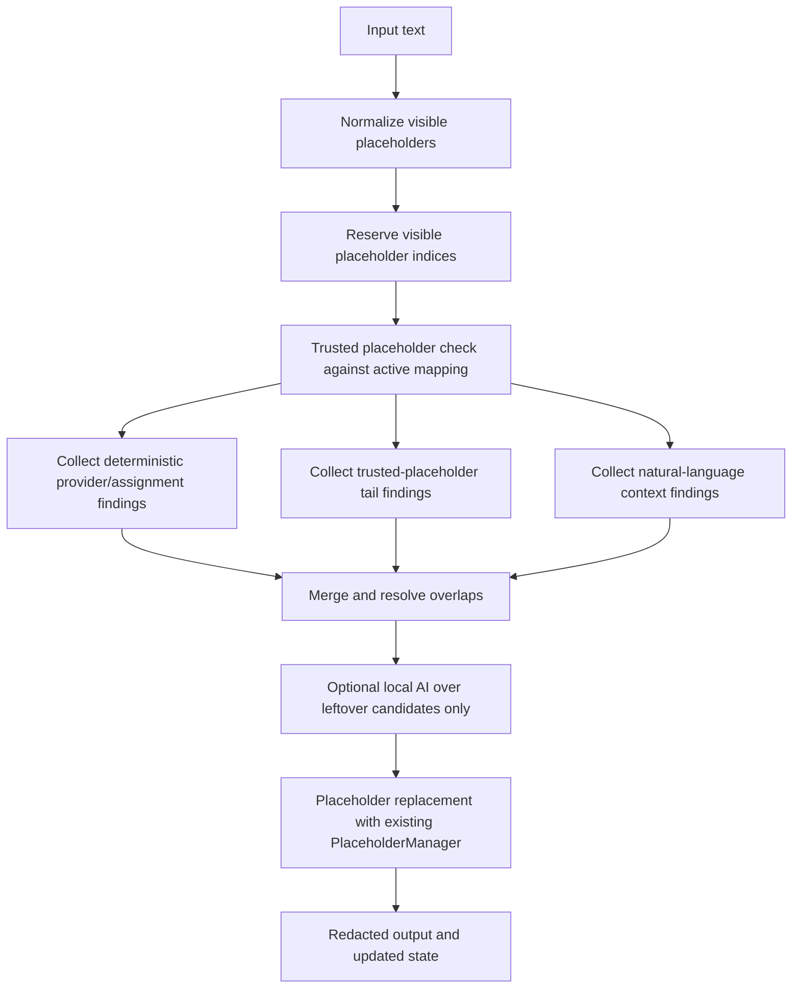
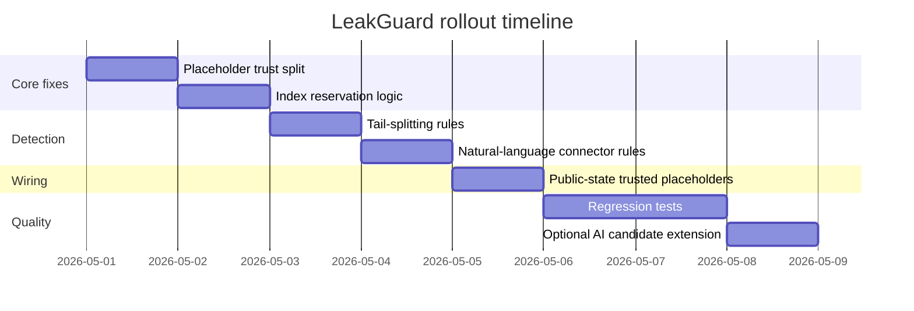

# LeakGuard Improvement Report

## Executive Summary

Using the enabled connector scan, I found that the only enabled connector is entity["company","GitHub","developer platform"], and I restricted the repository analysis to `petritbahtiri123/LeakGuard` as requested. LeakGuard already has a stronger foundation than a typical browser-side secret redactor: a broad deterministic rule set, context and suppression heuristics, session-scoped placeholder mapping, reuse-aware redaction, protected-site interception, an optional local ONNX-based AI assist layer, and a substantial test suite. The current engine already covers many provider-specific formats, natural-language password and API-key patterns, pagination-safe placeholder mapping, and typed interception before commit. fileciteturn21file0L1-L1 fileciteturn15file0L1-L1 fileciteturn16file0L1-L1 fileciteturn12file0L1-L1 fileciteturn14file0L1-L1 fileciteturn22file0L1-L1 fileciteturn30file0L1-L1

The most important remaining weakness is not “missing regexes” in the narrow sense. It is the trust model around visible placeholders. Right now, syntactically valid placeholders are normalized and tracked aggressively, which is useful for preserving existing redactions, but it creates a bypass class: unknown placeholder-like tokens can be mistaken for already-redacted content, and attached tails after a trusted placeholder are not handled as a first-class split case. This is exactly the class of failures your recent examples exposed. The next most important gap is broader natural-language disclosure detection: LeakGuard has several natural-language rules already, but they are still narrower than what users naturally type in chat. fileciteturn12file0L1-L1 fileciteturn15file0L1-L1 fileciteturn16file0L1-L1

The best-practice direction is a hybrid pipeline: provider-specific regexes and format rules for high precision; keyword and assignment-context heuristics for weakly structured secrets; entropy and structural signals as a supporting score, not a sole decision-maker; explicit false-positive suppression; and an optional ML/LLM stage only for leftover ambiguous candidates. That is how leading scanners position themselves: entity["company","Yelp","technology company"] `detect-secrets` explicitly combines regex, entropy, and keyword detectors; Gitleaks combines regex, keywords, entropy, and allowlists; entity["company","Truffle Security","security company"] TruffleHog combines classification and verification; and entity["company","GitHub","developer platform"] now uses LLM-based generic password scanning in a separate, higher-scrutiny lane. citeturn5search0turn6search0turn7search2turn7search7turn10search0

My main recommendation is a minimal-disruption, high-value change set:

1. **Split “visible placeholder reservation” from “trusted placeholder preservation.”**
2. **Only preserve placeholders that exist in active mapping/state.**
3. **Treat unknown placeholder-like tokens as candidates, not as safe placeholders.**
4. **Split attached tails off trusted placeholders and score the tail separately.**
5. **Expand natural-language connector rules and add a stronger deny-list for documentation/examples.**
6. **Keep the current deterministic-first architecture; optionally extend the existing local AI assist to score the new candidate classes, not replace deterministic detection.**

If implemented well, this should close the bypasses you surfaced while preserving LeakGuard’s existing strengths and architecture. That recommendation is also aligned with guidance from entity["organization","NIST","us standards body"], which explicitly warns against over-relying on simplistic password composition rules and instead recommends blocklists and context-specific handling, and with the entity["company","Dropbox","cloud storage company"] `zxcvbn` work, which showed why naive lowercase/uppercase/digit/symbol rules are a weak proxy for actual secret strength or guessability. citeturn19search0turn4search0turn13view0

## Scope, Connector Scan, and Assumptions

**Enabled connectors discovered via `api_tool`:**
- GitHub

**Repository analyzed:**
- `petritbahtiri123/LeakGuard`

**Assumptions used for the report:**

- LeakGuard’s active placeholder/session state is the tab-scoped state represented by `sessionId`, `counters`, `fingerprintToPlaceholder`, `placeholderToFingerprint`, `secretByFingerprint`, and `objects`, as defined in the shared session store and used by the background core. fileciteturn28file0L1-L1 fileciteturn22file0L1-L1
- The current synchronous redaction path should remain synchronous. That assumption matches the repo’s stated design: deterministic results stay authoritative, and the async wrapper exists only for optional local AI assist. fileciteturn30file0L1-L1
- It is acceptable to add one small optional argument to detection paths, such as `scan(text, { trustedPlaceholders, manager })`, without breaking existing callers.
- If the content-side scanner currently does not have access to the active placeholder set, the smallest practical change is to expose a trusted placeholder list in the tab’s public state or provide an equivalent background-backed lookup.
- The tail end of some large repo files, especially `detector.js`, was truncated by connector rendering; where direct file inspection was incomplete, I relied on the observable file body plus repo tests and docs, and I call that out explicitly where relevant. fileciteturn16file0L1-L1 fileciteturn19file0L1-L1

## Current LeakGuard Inventory

LeakGuard is a local-first browser extension with a shared deterministic detection/redaction stack, a background session-state manager, protected-site interception, and an optional local ONNX classifier for suspicious leftovers. The package metadata and docs describe it as a local-first secret redaction engine for LLM chat UIs, with `onnxruntime-web` packaged for local AI assist. fileciteturn21file0L1-L1 fileciteturn30file0L1-L1

### Current behavior inventory

**Regexes and provider patterns.**  
`patterns.js` already includes many provider and protocol rules: PEM/private keys, AWS secret/access/session assignments, Azure storage keys and connection strings, OpenAI keys, Anthropic keys, GitHub PAT/classic/app tokens, Slack tokens and webhooks, Discord webhooks, GitLab PATs, JWTs, Stripe secrets, Google keys and OAuth secrets, SendGrid, JSON credential fields, bearer/basic auth, Docker auth blobs, cookie/session tokens, query-string secrets, DB URIs, generic URI credentials, and some natural-language patterns such as “my password is ...” and “my openai key is ...”. It also defines keyword lists, negative-context words, assignment regexes, placeholder regexes, and template/example suppression markers. fileciteturn15file0L1-L1

**Entropy and structural heuristics.**  
`entropy.js` computes Shannon entropy over character frequencies, counts character-class variety, and flags “structured-like” secrets using minimum length, class variety, hex-only patterns, and base64-ish patterns with entropy gating. fileciteturn11file0L1-L1

**Detector heuristics and suppression.**  
The visible portion of `detector.js` shows that the engine combines pattern matches with context scoring, negative-context scoring, explicit sensitive assignment handling, safe assignment keys, exact credential keys, example/template suppression, host/example suppression, DB-URI parsing, path suppression, obfuscated-key handling, base64 decoding, IPv6 detection, and a bare-password heuristic that uses length, structure, context, and entropy rather than entropy alone. fileciteturn16file0L1-L1

**Placeholder handling and mapping.**  
`placeholders.js` defines canonical placeholder regexes for `[PWM_n]`, network placeholders, and legacy typed placeholders. It normalizes legacy typed placeholders into generic PWM placeholders via a stable hashed alias, and the `PlaceholderManager` maps raw secrets to placeholders by a session fingerprint derived from `sessionId + rawValue`. It tracks counters, known placeholders, reverse mappings, and structured network objects. It also exports public and private state, and it can rehydrate placeholders back to raw values for tests. fileciteturn12file0L1-L1

**Redaction and reuse behavior.**  
`redactor.js` preallocates placeholders for findings, scans the remaining plain-text segments for previously known raw secrets, and reuses existing placeholders when the same secret reappears. It also avoids some short-identifier false positives during reuse scanning. Output is normalized through placeholder normalization before returning. fileciteturn14file0L1-L1

**Session and background mapping logic.**  
`sessionMapStore.js` defines versioned session state with `sessionId`, `urlKey`, transform mode, counters, fingerprint maps, raw secret maps, and structured objects. `core.js` manages per-tab state in session storage, migrates legacy state, applies protected-site policies, performs redaction through `transformOutboundPrompt`, serializes results, and supports secure reveal requests. fileciteturn28file0L1-L1 fileciteturn22file0L1-L1

**Optional AI/NLP layer already present.**  
LeakGuard already has an optional local AI assist design. The docs state that deterministic findings remain authoritative, deterministic ranges are not reclassified, the full prompt is never sent to the classifier, and the classifier only sees small candidate windows. The candidate gate already extracts assignment values, colon values, JSON values, bare suspicious tokens, and URL credential segments, then scores them using entropy, length, class variety, secret keywords, safe-key penalties, and structural helpers before optional ONNX classification. fileciteturn30file0L1-L1 fileciteturn29file0L1-L1

**Tests.**  
The repo’s tests are substantial. `detector.test.js` covers pattern metadata, positive fixtures, negative examples, repeated-secret placeholder reuse, multiline cases, existing placeholders, connection-string handling, bearer/basic auth variants, overlap resolution, allowlists, docs/example suppressions, and placeholder composites. `adversarial_redaction.test.js` covers zero-width obfuscation, split strings, base64, IPv6, and spaced keys. `typed_interception.test.js` covers beforeinput interception, typed high-confidence password handling, medium-confidence username handling, placeholder normalization before commit, and keyboard/event containment in the modal flow. fileciteturn19file0L1-L1 fileciteturn20file0L1-L1 fileciteturn31file0L1-L1

### Repo vs. best-practice comparison

The comparison below is synthesized from the repo’s shared modules, background core, AI assist docs, and tests. fileciteturn15file0L1-L1 fileciteturn16file0L1-L1 fileciteturn12file0L1-L1 fileciteturn29file0L1-L1 fileciteturn30file0L1-L1 fileciteturn19file0L1-L1

| Feature | Repo status | Gap | Priority | Suggested change |
|---|---|---:|---:|---|
| Provider-specific regex coverage | Strong | Missing a few newer/adjacent token families and some prefix refinements | Medium | Add targeted prefixes such as OpenAI `sk-admin-` and more GitLab token families |
| Keyword/context scoring | Strong | Current lists are still narrower than live chat phrasing | High | Expand connector nouns/verbs and false-context deny-list |
| Natural-language detection | Partial | Covers several forms, but not broad “this is my secret / here’s the password / db password is ...” chat patterns | High | Add broader connector grammar and quoted/unquoted extraction |
| Template/example suppression | Strong | May still over-trust syntactic placeholders | Critical | Separate placeholder trust from placeholder syntax |
| Shannon entropy support | Strong | Entropy is still used as a scalar heuristic, not password-guessability-aware scoring | Medium | Keep entropy, but use it as one feature in a composite decision |
| Placeholder canonicalization | Strong | Canonicalization of legacy tokens is good; trust model is too permissive | Critical | Canonicalize freely, preserve only if token is in active mapping |
| Active placeholder trust model | Weak | Clean `[PWM_n]`-looking tokens can be treated as benign even if never mapped | Critical | Preserve only placeholders present in active mapping/state |
| Attached-secret after placeholder handling | Partial | Composite handling exists, but not as explicit trusted-placeholder + tail split logic | Critical | Split trusted placeholder and tail; scan tail separately |
| Fake placeholder resistance | Weak | Unknown placeholder-like tokens can masquerade as already-redacted content | Critical | Treat unknown placeholder-like tokens as candidates |
| Deterministic placeholder reuse | Strong | Good reuse behavior already exists | Low | Preserve; extend to tail fragments |
| Local AI assist | Strong | Candidate gate omits natural-language leftover spans and placeholder-edge cases | Medium | Extend candidate extraction to new contexts |
| Live verification of secrets | Missing by design | Not appropriate for local-only default path, but industry tools use it to cut FPs | Low | Keep off by default; consider optional enterprise/offline checksum or verification plug points |
| Typed interception | Strong | Needs explicit coverage for fake placeholders and attached tails | High | Add beforeinput regressions for placeholder-edge cases |
| Regression coverage | Strong | Missing the exact bypasses discussed in this conversation | Critical | Add targeted placeholder-trust and tail-splitting tests |

## Industry and Academic Landscape

The most mature secret scanners converge on a hybrid design. GitHub’s secret scanning combines supported provider patterns with custom patterns, and its custom pattern reference explicitly separates the **secret format** from **before secret**, **after secret**, and **additional match requirements**. That separation is directly relevant to LeakGuard’s placeholder-tail problem, because it is a formal way to distinguish “trusted boundary token” from “risky attached material.” citeturn11search0turn11search1

`detect-secrets` is very explicit about the three core strategies: **regex-based rules**, **entropy detectors**, and **keyword detectors**. Its docs also emphasize filters and baselines as the main false-positive control mechanism, and it exposes entropy thresholds directly for base64 and hex plugins. This is conceptually close to LeakGuard’s existing architecture, except `detect-secrets` treats keyword/context detection as a first-class strategy rather than a small add-on. citeturn5search0turn5search1

Gitleaks similarly uses **regex**, **keywords** for fast prefiltering, **optional entropy checks on a designated secret group**, and **allowlists/stopwords** that can target either the extracted secret or the full match. This is a strong institutional signal that LeakGuard should not try to solve the placeholder problem with regex alone. It should add a stopword/deny-list and rule-specific post-processing layer for placeholder-edge cases. citeturn6search0

TruffleHog pushes the hybrid model further: it classifies hundreds of secret types and, when appropriate, verifies them with providers. Its custom regex detectors also require at least one regex and one keyword, and support entropy filters plus excluded word lists. Even if LeakGuard remains local-first and non-verifying, the architectural lesson is still useful: **provider formats + keyword prefilters + post-match policy filters** are a better design than regex alone. citeturn7search2turn6search1turn7search7

On the academic side, the pattern is similar. The 2020 COMSNETS work on “Secrets in Source Code” proposed a generalized regex-based detector plus ML classification to reduce false positives, explicitly including generic passwords among the target classes. More recent work presented at ESEM 2025 reports that a hybrid regex-plus-LLM approach can outperform regex-only baselines on source-code secret detection, again with the key benefit being reduced false positives through context understanding rather than better string-shape matching alone. citeturn17search7turn18search7

For weakly structured passwords, the password literature matters. The `zxcvbn` work showed why classic LUDS-style rules—lowercase, uppercase, digits, symbols—are a bad proxy for real guessability, and NIST now explicitly recommends blocklists and context-specific rejection rather than extra composition rules. NIST also notes that estimating entropy for user-chosen passwords is challenging, which is highly relevant here: entropy should help LeakGuard rank and suppress candidates, but it should not be the only trigger for “password-like” chat disclosures. citeturn4search0turn19search0turn13view0

GitHub’s Copilot secret scanning is especially relevant to the “natural-language secrets” problem. GitHub describes it as an AI-powered generic password detector, separate from regular secret scanning alerts explicitly because it can be noisier. It also documents design limitations: it does not aim to detect obviously fake/test passwords or low-entropy passwords, and it keeps generic password detections in a separate review lane. LeakGuard’s existing optional AI assist already resembles that philosophy; the right improvement is to feed it better candidate spans, not to replace deterministic detection. citeturn10search0turn10search1

Stable prefix families remain one of the best precision levers. Official docs expose strong format clues for GitHub credential types (`ghp_`, `github_pat_`, `gho_`, `ghu_`, `ghs_`, `ghr_`), GitLab tokens (`glpat-`, `gldt-`, `glrt-`, `glcbt-`, `glptt-`, and others), Slack token types (`xoxp-`, `xapp-`, and related families), Anthropic keys (`sk-ant-...` in partial hints), and OpenAI redacted key examples (`sk-...`, `sk-admin...`). LeakGuard already covers many of these, but it should refresh the set periodically and fill the misses. citeturn9search0turn8search2turn8search3turn8search0turn16search0turn16search8

## Recommended Detection Design

### The core design change

The central change should be this rule:

> **Syntactic placeholder validity is not the same thing as trust.**  
> Preserve a visible placeholder only if it is present in the active mapping/state. Treat unknown placeholder-like strings as candidates.

That one change solves the fake-placeholder laundering class without undoing LeakGuard’s reuse and stateful redaction design.

A second rule should accompany it:

> **Reserve visible PWM indices for allocation, even when the visible placeholder is untrusted.**  
> This prevents “redacting” an unknown raw token like `[PWM_1]` back into `[PWM_1]`, which would leave the output effectively unchanged.

### Concrete rules to add

#### Trusted placeholder logic

**New behavior**
- A visible token such as `[PWM_1]` is preserved **only if** `manager.knowsPlaceholder("[PWM_1]") === true`, or if it is a semantic network placeholder present in active structured objects/state.
- Unknown placeholder-like tokens are not auto-preserved.
- All visible syntactic placeholder indices should still be reserved from future allocation so newly emitted placeholders cannot equal visible fake tokens.

**Why this matters**
- It prevents fake placeholders from acting as escape hatches.
- It preserves deterministic mapping and avoids redaction no-ops.

#### Attached-secret detection after placeholders

**New behavior**
- If a token starts with a **trusted** placeholder and then continues with suspicious material, split it:
  - preserve the trusted placeholder,
  - treat the tail as a new candidate,
  - redact only the tail if it scores as secret-like.

**Examples**
- Active mapping contains `[PWM_2]`  
  `my password is [PWM_2]4512341234`  
  → preserve `[PWM_2]`, scan `4512341234`
- Active mapping contains `[PWM_1]`  
  `token=[PWM_1]prodABC123XYZ`  
  → preserve `[PWM_1]`, scan `prodABC123XYZ`

**Important nuance**
- If the placeholder is **not trusted**, do not split. Treat the entire token as a secret candidate.

#### Natural-language connector expansion

LeakGuard already has some natural-language patterns. Expand them with a small grammar rather than one-off regexes.

**Connectors to add**
- Nouns: `password`, `passcode`, `passphrase`, `pwd`, `db password`, `secret`, `api key`, `access token`, `refresh token`, `bearer token`, `client secret`, `private key`, `webhook secret`
- Phrases: `this is my`, `here is my`, `here's my`, `actual`, `real`, `prod`, `production`, `live`
- Verbs/operators: `is`, `=`, `:`, `->`, `→`, `equals`, `set to`, `should be`, `becomes`

**Examples to catch**
- `this is my secret abc123DEF!`
- `my db password is Hunter2Strong!`
- `here's the token: eyJ...`
- `real value: sk-admin-...`
- `password -> OpenSesame123!`

#### False-context deny-list

Add a stronger deny-list around the candidate window. Existing example/template suppression is good; it should be extended to the kinds of benign discussions users type in chat.

**Suggested deny-list**
- `example`, `sample`, `dummy`, `placeholder`, `fake`, `mock`, `template`, `redacted`, `masked`, `sanitized`, `replace me`, `changeme`
- `password policy`, `password strength`, `regex`, `pattern`, `validator`, `generator`, `example password`, `test password`
- Already-safe pseudo-secret keys:
  - `password_hint`
  - `secret_santa`
  - `token_limit`
  - `api_version`
  - `build_id`
  - `commit_sha`
  - `region`
  - `environment`
  - `public_url`

#### Prefix families to refresh

LeakGuard should keep its current strong provider set and add a few high-signal misses. At minimum:

- OpenAI admin keys: `sk-admin-...` citeturn16search8
- GitLab token families beyond `glpat-`: `gldt-`, `glrt-`, `glcbt-`, `glptt-`, `glft-`, `glimt-`, `glagent-`, `glwt-` citeturn8search2
- Slack families should remain aligned with official token types and app-level tokens such as `xapp-`; keep existing `xox*` families but refresh against current docs. citeturn8search3

### Composite scoring heuristic

A practical composite score for ambiguous candidates should look like this:

- **High-confidence trigger**
  - explicit vendor prefix, or
  - explicit secret connector context + non-denylisted value, or
  - DB/basic-auth/password-bearing URI parsing
- **Supporting features**
  - assignment key match
  - natural-language connector match
  - Shannon entropy band
  - character-class variety
  - structural shape (`looksStructuredLikeSecret`)
  - base64-decoded sensitivity
  - attached-tail-after-trusted-placeholder bonus
- **Penalties**
  - example/template markers
  - safe keys
  - versions/regions/build labels
  - paths/URLs without credentials
  - email-like usernames where only identity is present

A simple decision ladder that matches LeakGuard’s current style:

- `score >= 75` → redact
- `score 55–74` → redact on protected/strict paths, warn otherwise
- `< 55` → ignore unless exact provider regex matched

### JS integration snippets

#### Trust-aware placeholder preservation and index reservation

```js
// src/shared/placeholders.js

function extractVisiblePwmIndices(text) {
  const input = String(text || "");
  const matches = input.match(/\[PWM_(\d+)\]/g) || [];
  return matches
    .map(token => {
      const m = /^\[PWM_(\d+)\]$/.exec(token);
      return m ? Number(m[1]) : null;
    })
    .filter(Number.isFinite);
}

function reserveVisiblePlaceholderSlots(manager, text) {
  if (!manager) return;
  const visibleMax = Math.max(0, ...extractVisiblePwmIndices(text));
  if (visibleMax > Number(manager.counters?.PWM || 0)) {
    manager.counters.PWM = visibleMax;
  }
}

// Preserve only mapped placeholders, but still reserve visible indices.
function isTrustedVisiblePlaceholder(token, manager, trustedPlaceholders = null) {
  const canonical = canonicalizePlaceholderToken(token);
  if (trustedPlaceholders && trustedPlaceholders.has(canonical)) return true;
  return Boolean(manager?.knowsPlaceholder?.(canonical));
}
```

#### Split trusted placeholder tails

```js
// src/shared/detector.js

const TRUSTED_TAIL_REGEX =
  /^(\[(?:PWM_\d+|NET_\d+(?:_SUB_\d+)*(?:_(?:HOST_\d+|GW|VIP|DNS))?|PUB_HOST_\d+(?:_(?:GW|VIP|DNS))?)\])([A-Za-z0-9._~+\/=-]{4,})$/;

function splitTrustedPlaceholderTail(token, manager, trustedPlaceholders) {
  const m = TRUSTED_TAIL_REGEX.exec(String(token || ""));
  if (!m) return null;

  const [, placeholder, tail] = m;
  if (!isTrustedVisiblePlaceholder(placeholder, manager, trustedPlaceholders)) {
    return { trusted: false, raw: token, placeholder: null, tail: null };
  }

  return { trusted: true, raw: token, placeholder, tail };
}
```

#### Expanded natural-language harvesting

```js
// src/shared/detector.js

const NL_SECRET_CONTEXT_REGEX =
  /\b(?:this\s+is\s+my|here(?:'s| is)\s+my|my|the|our|actual|real|prod(?:uction)?|live)?\s*(password|passcode|passphrase|pwd|db[_ -]?password|secret|api[_ -]?key|access[_ -]?token|refresh[_ -]?token|bearer(?: token)?|client[_ -]?secret|private[_ -]?key|webhook(?: secret)?)\s*(?:is|=|:|->|→|equals|set to|should be|becomes)\s*(?:"([^"\r\n]{3,256})"|'([^'\r\n]{3,256})'|`([^`\r\n]{3,256})`|([^\s,;]{3,256}))/gi;

function collectNaturalLanguageFindings(text, options = {}) {
  const input = String(text || "");
  const findings = [];
  let match;

  while ((match = NL_SECRET_CONTEXT_REGEX.exec(input)) !== null) {
    const raw = match[2] || match[3] || match[4] || match[5] || "";
    const start = match.index + match[0].lastIndexOf(raw);
    const end = start + raw.length;
    const ctx = input.slice(Math.max(0, start - 64), Math.min(input.length, end + 64));

    if (isFalseContextWindow(ctx)) continue;
    if (looksBenignLiteral(raw)) continue;

    findings.push({
      id: crypto.randomUUID(),
      type: inferTypeFromContext(match[1]),
      placeholderType: inferTypeFromContext(match[1]),
      category: "credential",
      raw,
      start,
      end,
      score: scoreSuspiciousValue(raw, { contextText: ctx, naturalLanguage: true }),
      severity: "high",
      method: ["natural-language-context"]
    });
  }

  return findings;
}
```

### Migration plan with minimal disruption



1. **Add trust-aware placeholder primitives**
   - Files: `src/shared/placeholders.js`, `src/shared/sessionMapStore.js`
   - Goal: split slot reservation from trust

2. **Extend detector entrypoints**
   - File: `src/shared/detector.js`
   - Goal: accept `manager` or `trustedPlaceholders`, add placeholder-tail and natural-language collectors

3. **Expose active placeholder trust set**
   - File: `src/background/core.js`
   - Goal: include active known placeholders in public state, or provide equivalent lookup

4. **Preserve existing redaction path**
   - File: `src/shared/redactor.js`
   - Goal: no major redesign; only ensure reservation step runs before allocation

5. **Optionally extend AI candidate gate**
   - File: `src/shared/aiCandidateGate.js`
   - Goal: add placeholder-tail and natural-language leftovers as candidate sources, but keep deterministic findings authoritative

This path avoids a rewrite and keeps `transformOutboundPrompt()` synchronous. fileciteturn25file0L1-L1 fileciteturn30file0L1-L1

## Regression Test Suite

The table below focuses on the exact classes of edge cases discussed here and in your examples. These should be added alongside the current detector, adversarial, AI, and typed interception tests. The expected outputs below assume a trusted active mapping set is available and that visible placeholder indices are reserved before new allocation. Existing tests already cover many adjacent areas like placeholder reuse, benign placeholder composites, zero-width keys, base64, and typed interception. fileciteturn19file0L1-L1 fileciteturn20file0L1-L1 fileciteturn31file0L1-L1

| Case | Active mapping | Input | Expected output / assertion |
|---|---|---|---|
| Trusted placeholder preserved | `[PWM_1]` | `my password is [PWM_1]` | No new finding; output unchanged |
| Trusted placeholder repeated | `[PWM_1]` | `my password is [PWM_1] my password is [PWM_1]` | No new finding; output unchanged |
| Unknown clean placeholder in secret context | none | `my password is [PWM_21234123]` | Entire token treated as candidate; redact to a new PWM token not equal to raw visible token |
| Unknown standard-looking placeholder | none | `my password is [PWM_1]` | Entire token treated as candidate; replacement must not remain `[PWM_1]` |
| Trusted placeholder + numeric tail | `[PWM_2]` | `my password is [PWM_2]4512341234` | Preserve `[PWM_2]`; tail is redacted separately |
| Trusted placeholder + alpha-numeric tail | `[PWM_2]` | `token=[PWM_2]prodABC123XYZ` | Preserve `[PWM_2]`; tail separately scanned/redacted |
| Trusted placeholder + benign suffix | `[PWM_2]` | `file=[PWM_2].json` | Preserve placeholder; no new finding |
| Unknown placeholder + tail | none | `my password is [PWM_2]4512341234` | Treat whole token as candidate if not trusted |
| Adjacent trusted placeholders stay benign | `[PWM_3] [PWM_4]` | `DB_PASSWORD=[PWM_4]OPENAI_API_KEY=[PWM_3]` | No secret composite finding |
| Fake typed placeholder family | none | `secret=[PASSWORD_2]` | Not auto-trusted; candidate handling depends on context and score |
| Natural-language “this is my secret” | none | `this is my secret HarborLock4455!` | High-confidence secret detection/redaction |
| Natural-language db password | none | `my db password is HarborLock4455!` | High-confidence password detection/redaction |
| Natural-language real value | none | `real value: sk-admin-abcDEF1234567890xyz` | API key candidate detected/redacted |
| Docs/example false context | none | `what is the regex pattern for passwords like Password1!` | No finding |
| Example marker suppression | none | `my password is example-placeholder-secret` | No finding |
| Password-hint suppression | none | `password_hint=ask-admin` | No finding |
| Secret-santa safe key | none | `secret_santa=true` | No finding |
| Region safe literal | none | `region=eu-central-1` | No finding |
| Mixed trusted placeholders with tails | `[PWM_1] [PWM_2]` | `my password is [PWM_1]3123312 my password is [PWM_2]234123` | Each trusted placeholder preserved; each tail gets its own new placeholder |
| Unknown placeholder-like token in typed interception | none | typed insertion of `[PWM_99999]` into `password=` | Beforeinput path flags it; replacement differs from raw token |
| Trusted placeholder tail in typed interception | `[PWM_5]` | typed insertion of `[PWM_5]abc123XYZ` into `password=` | Beforeinput path preserves `[PWM_5]` and redacts tail |
| AI candidate gate on natural-language leftover | none | `here is my token abc123def456ghi789` | Deterministic or AI-assist candidate created from local context only, not full prompt |
| Reserved index monotonicity | visible fake `[PWM_7]`, no trust | `my password is [PWM_7]` | First newly emitted replacement must be `[PWM_8]` or later |
| Repeated fake placeholder token | none | `my password is [PWM_42] and again [PWM_42]` | Same raw token maps to one consistent new placeholder |

## Security Considerations, Effort, and Codex Prompt

### Security considerations and bypass vectors

The primary bypass vector is **placeholder laundering**: a user can type something that merely looks like a LeakGuard placeholder and rely on syntax-based trust. The mitigation is the trust split described above: preserve only actively mapped placeholders, but reserve visible indices so replacements remain monotonic and outputs always change when redaction occurs. fileciteturn12file0L1-L1

A second bypass vector is **tail smuggling**: append a live secret fragment directly after a trusted placeholder. LeakGuard already has some placeholder-composite logic, but it should elevate this to an explicit trusted-placeholder split rule because that is both easier to reason about and easier to test. fileciteturn15file0L1-L1

A third bypass vector is **Unicode and formatting obfuscation**. The repo already tests zero-width characters and spaced-out key names, which is good. The next step is to normalize Unicode more aggressively around key detection, strip format controls in the key-only path, and keep tests for confusables and delimiter tricks. fileciteturn20file0L1-L1

A fourth risk is **alert fatigue from benign chat discussion** about passwords, regexes, or policy. This is why the deny-list is essential. GitHub’s own AI generic password detection keeps such results in a separate lane because generic-password detection is inherently noisier than provider-pattern scanning. LeakGuard should preserve its deterministic-first design and use higher scrutiny for ambiguous natural-language candidates. citeturn10search0

There is also a **bundle-size and privacy tradeoff**. Adding a heavy guessability library such as a full `zxcvbn` dependency would improve password-context ranking, but it would also increase browser bundle size. LeakGuard already has a local candidate gate and ONNX assist, so the minimal path is to reuse and extend the existing scoring system first. Phase-two evaluation can then decide whether a lightweight guessability model is worth the size cost. fileciteturn29file0L1-L1 fileciteturn30file0L1-L1 citeturn4search0

### Estimated effort and simplest integration path

**Simplest path**
- No new server dependency
- No change to the deterministic-first philosophy
- No rewrite of redactor or transform pipeline
- One new trust-aware argument path into `Detector.scan`

**Estimated effort**
- Placeholder trust split and reservation logic: **1 day**
- Detector additions for tails and expanded natural-language rules: **1–2 days**
- Public-state plumbing for trusted placeholders: **0.5–1 day**
- Test additions and regression stabilization: **1–2 days**
- Optional AI candidate gate extension: **0.5–1 day**

**Total:** about **3–5 engineer-days**, plus **1–2 days** of QA/review if done carefully.



### Precise Codex prompt

```text
Implement a trust-aware placeholder and natural-language secret detection upgrade in the GitHub repo `petritbahtiri123/LeakGuard`.

Goals:
1. Preserve existing placeholders ONLY if they are present in the active mapping/state.
2. Treat unknown placeholder-like tokens as secret candidates.
3. Split attached secret tails from trusted placeholders and scan/redact the tail separately.
4. Maintain deterministic PWM index mapping and never emit a replacement that is text-identical to an untrusted visible placeholder-like token already present in the input.
5. Expand natural-language secret detection for password/secret/token/API key disclosures.
6. Keep the existing deterministic-first architecture and preserve sync `transformOutboundPrompt()` behavior.
7. Extend tests to cover the new behavior.
8. Add a small design doc with Mermaid diagrams for tokenization flow and a rollout timeline chart.

Repository constraints:
- Prefer minimal disruption to existing architecture.
- Node.js / shared browser modules attach to `globalThis.PWM`.
- Do not remove existing behavior unless it conflicts with the new trust model.
- Existing deterministic findings remain authoritative.
- Preserve existing placeholders only if present in active mapping.
- Unknown placeholder-like tokens are candidates, not trusted placeholders.
- Existing visible placeholder indices must still be reserved so newly emitted placeholders never equal raw fake placeholder-like input.

Files to modify:
- `src/shared/placeholders.js`
- `src/shared/detector.js`
- `src/shared/redactor.js`
- `src/shared/sessionMapStore.js` if needed
- `src/background/core.js`
- `src/shared/aiCandidateGate.js` (optional but preferred for leftover ambiguous candidates)
- `tests/detector.test.js`
- `tests/adversarial_redaction.test.js`
- `tests/typed_interception.test.js`

Files to consider creating:
- `tests/placeholder_trust.test.js`
- `tests/natural_language_context.test.js`
- `docs/DETECTION_ENHANCEMENTS.md`

Exact behavior required:
- Add logic that distinguishes:
  - trusted placeholders = placeholders present in active mapping/state
  - visible placeholder-like syntax = any token that merely looks like `[PWM_n]`, `[PASSWORD_n]`, `[TOKEN_n]`, etc.
- Trusted placeholders must be preserved.
- Unknown placeholder-like tokens must not be auto-preserved.
- Visible placeholder indices like `[PWM_7]` must still reserve slot 7 so that if the token is untrusted and redacted, the emitted replacement is `[PWM_8]` or later, never `[PWM_7]`.
- If a trusted placeholder is immediately followed by suspicious tail content, e.g. `[PWM_2]4512341234` or `[PWM_2]prodABC123XYZ`, preserve `[PWM_2]` and create a finding for the tail only when the tail scores as secret-like.
- If the placeholder is not trusted, do NOT split; treat the whole token as a candidate.
- Expand natural-language detection to catch phrases like:
  - `this is my secret ...`
  - `here is my password ...`
  - `my db password is ...`
  - `real value: ...`
  - `token -> ...`
- Add false-context deny-list logic so benign discussion text such as regex help, password policy, example/sample/dummy/fake/template text, `password_hint`, `secret_santa`, `token_limit`, `api_version`, `build_id`, `region`, `environment`, etc. does not trigger.
- Keep overlap resolution deterministic and stable.
- Keep placeholder reuse deterministic through `PlaceholderManager`.
- Do not degrade existing repeated-secret placeholder reuse.
- Do not break benign adjacent clean placeholder assignment cases already covered by tests.

Implementation hints:
- Add a helper to reserve visible PWM indices separately from trusting placeholders.
- Add a helper such as `isTrustedVisiblePlaceholder(token, managerOrSet)`.
- Consider extending `Detector.scan(text, options = {})` so callers can provide `manager` or `trustedPlaceholders`.
- If content-side detection needs the trust set, expose `knownPlaceholders` or an equivalent trusted placeholder set in public tab state from `src/background/core.js`.
- Reuse existing entropy/class-variety/context helpers where possible.
- Reuse `aiCandidateGate` for leftover ambiguous candidate types if it can be extended cheaply.

Test cases that must be added:
- trusted placeholder preserved
- repeated trusted placeholder preserved
- unknown clean placeholder in password context redacts
- unknown standard-looking `[PWM_1]` does NOT remain unchanged when redacted
- trusted placeholder + numeric tail splits and redacts tail
- trusted placeholder + benign suffix like `.json` stays benign
- unknown placeholder + tail treated as whole-token candidate
- expanded natural-language contexts catch real disclosures
- deny-list suppresses regex/policy/example discussion
- visible fake placeholder indices are reserved so replacement numbering remains deterministic and monotonic
- typed interception catches unknown placeholder-like secrets and trusted-placeholder tail cases

Documentation:
- Create/update `docs/DETECTION_ENHANCEMENTS.md` with:
  - a Mermaid flowchart for placeholder-aware tokenization and detection
  - a Mermaid gantt/timeline chart for rollout phases

Output:
- Commit-ready code changes
- Passing tests
- Clear comments only where behavior is subtle
```

### Open questions and limitations

The one material limitation in this report is that parts of the very large `detector.js` file were truncated by connector rendering, so some internal behavior—especially the exact final overlap-resolution implementation—was inferred from the visible file body and the repo’s tests rather than read line-by-line from the entire file. That does not affect the main recommendation, because the critical gaps are visible directly in placeholder handling, pattern scope, AI assist docs, and regression coverage. fileciteturn16file0L1-L1 fileciteturn19file0L1-L1

The second open question is whether the content-side detector currently has easy access to the active trusted placeholder set. If not, the cleanest implementation choice is to expose `knownPlaceholders` in the tab’s public state or add a very small background-assisted trust lookup. I treated that as an implementation assumption because the current public state appears to expose only `transformMode`, `placeholderCount`, and policy summary. fileciteturn22file0L1-L1