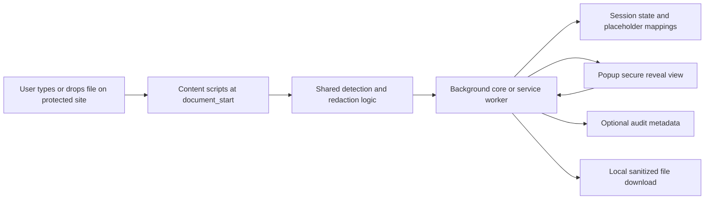
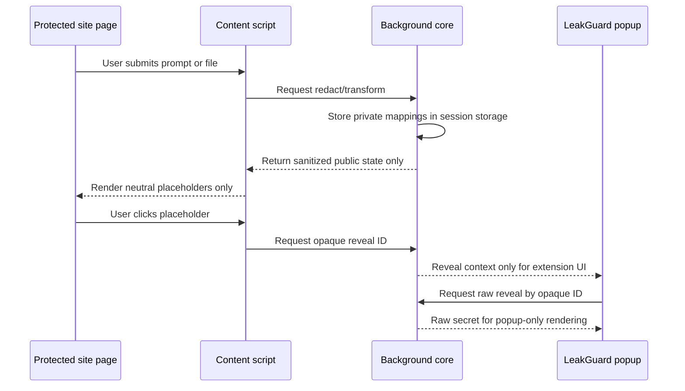

# LeakGuard Browser Extension Repository Review

## Executive summary

I reviewed the public LeakGuard browser-extension repository linked from its Firefox Add-ons homepage and analyzed its manifests, core/background code, content-script and file-handling paths, compatibility layer, documentation, tests, CI/CD configuration, security posture, and release packaging. The repository is not a throwaway prototype: it has a clearly stated “local-only” security model, a restrictive extension-page CSP, separate Chrome and Firefox manifests, active GitHub Actions workflows for tests and CodeQL, weekly Dependabot updates, and a documented secure-reveal architecture that keeps raw secrets out of page DOM and limits reveal to extension UI. The current extension version in the shared base manifest is `1.7.0`, and the repo contains browser-specific packaged artifacts and source zips under `release/`. citeturn10view2turn11view0turn21view0turn40view0turn40view1turn45view0turn24view2

The strongest positives are architectural. Built-in `host_permissions` are limited to a short list of AI/chat destinations, while user-added sites are handled through optional origin grants plus dynamic content-script registration. Firefox gets a separate background-script manifest instead of a service worker, and the compatibility layer explicitly abstracts browser namespace choice, dynamic-content-script support, and `storage.session` availability. In the reviewed code paths, I did not find `fetch()`, `XMLHttpRequest`, `WebSocket`, or `sendBeacon` usage, and I also did not find `eval()` or `innerHTML` usage in the main content/popup/scanner paths I inspected. That is unusually good discipline for an extension handling sensitive text. citeturn21view0turn21view1turn36view0turn36view3turn49view0turn49view4turn31view0turn31view1turn31view2turn31view3turn31view4turn31view5turn31view6turn31view7turn31view8turn32view0turn32view1turn32view2turn32view3turn32view4turn32view5turn32view6turn33view0turn33view1turn33view2turn33view3turn33view4turn33view5turn33view6

The main risks are not “obvious malware-extension” risks. They are now mostly maintainability, testing depth, and release-process risks. The repo still declares broad `optional_host_permissions` for all `http://*/*` and `https://*/*`, but that is intentionally preserved for arbitrary custom protected-site grants and now has exact-origin request tests. Content scripts still run at `document_start` with `all_frames` and `match_about_blank`, which is understandable for interception reliability but keeps the regression surface large. The previous `storage.session` to `storage.local` private-state fallback, release debug-output concern, audit-retention gap, sourcemap gap, and drag-guard teardown gap have been addressed. Several critical files remain large enough to create long-term reviewability and regression risk. citeturn21view0turn49view0turn40view4turn34view0turn35view6turn48view12turn50view8turn50view9turn25view5turn25view0turn25view8turn25view9turn25view15turn25view13

My overall judgment is that LeakGuard now has a stronger security/privacy foundation than the original review captured. The next hardening round should focus on maintainability, browser smoke CI, release artifact publishing hygiene, SBOM/license reporting, runtime budgets, and explicit Edge/Safari support posture rather than the already-closed debug/session/audit/sourcemap items. citeturn52view0turn52view2turn40view0turn40view1turn47view0turn40view4

## Scope and evidence base

This review is based on the public GitHub repository referenced from the Firefox add-on page, plus the repository’s manifests, source files, tests, security docs, compatibility docs, GitHub Actions workflows, security tab, and release artifact listings. I also cross-checked extension-security expectations against Chrome’s permissions guidance, MDN’s cross-browser WebExtensions guidance, and the OWASP browser-extension vulnerabilities cheat sheet. citeturn10view2turn11view0turn52view0turn52view1turn52view2

A limitation matters here: this report is not a full red-team pass. Since the original review, `npm audit --omit=dev --audit-level=high` has been run locally and added to CI, and it currently reports zero vulnerabilities. OSV tooling, secret scanners, browser automation, runtime memory profiling, and release signing/provenance still have not been fully proven here. Where I say “not found,” that means “not found in the reviewed repository files and inspected paths,” not “mathematically impossible anywhere in the codebase.”

## 2026-05-28 hardening update

Several items from the original review have now been addressed in the repository. Release builds strip content-script debug helpers and debug console paths from `dist/` while keeping source diagnostics available for development. Release artifact checks now assert no sourcemaps, no `sourceMappingURL` references, and no `debugReveal`, `debugLogSnapshot`, `pwm:debug`, `console.group*`, or `console.log` debug paths in packaged content scripts. Private placeholder and reveal session state no longer falls back to `storage.local`; when `storage.session` is unavailable, LeakGuard uses ephemeral extension memory instead. Audit logging remains metadata-only and now has bounded `auditRetentionDays` policy support with automatic purge. The early file drag guard now has explicit listener teardown, custom-site permission tests prove exact-origin grant requests, and CI now runs `npm audit --omit=dev --audit-level=high`.

The remaining major open items are long-term maintainability refactors, browser smoke CI including Edge proof, release artifact publishing hygiene, SBOM/license reporting, runtime size/latency budgets, and signed-release provenance.

## Detailed findings

LeakGuard’s high-level architecture is sound. The extension injects a content stack for targeted AI/chat domains, keeps session/private state in extension-owned storage, coordinates policy and protected-site registration in the background, and routes secure reveal into the popup rather than the page. The repo’s own security review describes the intended safe-reveal model clearly: inert neutral placeholders remain in page DOM, clicking a placeholder opens a popup via opaque request ID, the popup calls the background from extension origin, and raw text is rendered only inside the popup, never back into the page. The base manifest also enforces an extension-page CSP of `script-src 'self'; object-src 'none'; base-uri 'none'; frame-ancestors 'none';`. citeturn40view3turn21view0

The permission model is mixed but improved. The positive side is that built-in `host_permissions` are limited to a finite set of AI/chat origins, user-added sites are handled through `permissions.request()` from the popup, and dynamic content scripts are registered only for origins that have been granted. The extension still declares broad `optional_host_permissions` for all HTTP and HTTPS origins because arbitrary custom protected-site support needs that envelope in Chrome/Firefox. The important hardening point is now covered by tests: custom-site grants request normalized exact-origin match patterns rather than raw URLs, wildcard user input, or broad origins. The residual risk is still user comprehension and review discipline around optional grants, not default access to every site. citeturn21view0turn48view13turn36view0turn36view3turn52view0turn52view2

The injection model deserves a sober look. The content scripts run at `document_start`, with `all_frames: true` and `match_about_blank: true`, and the background can also insert CSS/scripts into a tab when custom site protection is enabled. That is understandable for interception reliability, particularly on complex AI web apps and nested upload flows, but it increases both surface area and performance sensitivity. If something goes wrong in page compatibility, it will go wrong early and across frames. From a security standpoint, this is still far better than blanket `<all_urls>` host permissions, but from an operational standpoint it means your regression suite has to be excellent. citeturn21view0turn36view2turn36view3

Privacy posture is generally strong and has improved since the original review. In the reviewed files I did not find outbound network primitives such as `fetch()`, `XMLHttpRequest`, `WebSocket`, or `sendBeacon` in the core, content, popup, scanner, detector, file-scanner, or AI-transform paths I inspected. Firefox’s manifest also explicitly declares no required data-collection permissions in `browser_specific_settings.gecko.data_collection_permissions.required`. The earlier private-state persistence caveat has been addressed: private placeholder and reveal state no longer falls back to `storage.local` when `storage.session` is unavailable; it uses ephemeral extension memory instead. Audit entries remain metadata-only rather than raw-secret blobs, and they now have bounded `auditRetentionDays` policy support with automatic purge. citeturn31view0turn31view1turn31view2turn31view3turn31view4turn31view5turn31view6turn31view7turn31view8turn32view0turn32view1turn32view2turn32view3turn32view4turn32view5turn32view6turn21view1turn49view0turn49view5turn49view6turn34view0turn35view6

The repo’s own security review is thoughtful and concrete. It explicitly documents prior insecure patterns — content-script raw lookup, page-DOM reveal, masked raw previews, and sanitized-debug failures — and describes the fixes: neutral placeholders, private-vs-public state splitting, popup-only reveal, opaque request IDs, and extension-UI sender checks. That is exactly the kind of design note I like to see in a sensitive extension. It shows the maintainer is actively thinking about hostile-page threat models rather than just shipping functionality. The downside is that this security model now depends on a lot of coordination across very large files. If those files keep growing, the odds of accidentally reintroducing a boundary violation go up. citeturn40view3turn25view5turn25view0

Maintainability is the biggest structural weakness in the repository. The architecture exists, but the file sizes show that responsibilities are still too concentrated. `core.js`, `content.js`, `detector.js`, `patterns.js`, `policy.js`, `fileScanner.js`, and `transformOutboundPrompt.js` are all large enough to slow review, broaden merge conflicts, and raise regression risk. That matters here because LeakGuard is enforcing sensitive boundaries: DOM rewriting, runtime messaging, protected-site management, audit logging, file scanning, and reveal security. Big files make boundary reasoning harder, and “harder to reason about” is exactly what you do not want in a security-sensitive extension. citeturn25view0turn25view5turn25view8turn25view9turn25view11turn25view13turn25view15

That said, some internal coding choices are good signs. `content.js` uses `WeakSet` and `WeakMap` for several transient file-handoff and editor-tracking structures, which reduces the likelihood of accumulating strong references to DOM or File objects. The file scanner also uses `URL.createObjectURL()` followed by `URL.revokeObjectURL()`, which is the right cleanup pattern for local downloads. These are the sort of small choices that separate a careful extension from a sloppy one. citeturn50view0turn50view1turn50view2turn48view16

The earlier memory-lifecycle concern in `file_drag_guard.js` has been addressed. The guard still binds early enough to block raw file drags, but it now supports explicit teardown with `AbortController` where available and fallback `removeEventListener` cleanup otherwise. Regression coverage verifies disposal and fresh reinjection while preserving early raw-file blocking. citeturn50view10turn51view0turn51view1turn51view2

The release debug story is now substantially hardened. Source diagnostics such as `debugLogSnapshot()` and `debugReveal()` remain available for local development, but release builds strip those helpers, `pwm:debug`, and grouped/logging console paths from packaged content scripts. Build-target tests assert those debug paths do not ship in `dist/`. citeturn40view3turn48view12turn50view8turn50view9

File handling is one of the more mature parts of the extension. The content path contains explicit messaging around large-file safety limits, including a user-facing block for files over 50 MB that the extension cannot safely sanitize yet, and the shared streaming redactor uses `TextDecoder("utf-8", { fatal: true })` with chunked processing. That is the right direction: fail closed on oversized content, stream where possible, and keep the user-facing message honest. The scanner page also downloads local artifacts via Blob/object-URL flow and revokes the object URL afterward. citeturn50view6turn51view8turn51view7turn48view16

The AI/build story is useful but adds complexity. The build scripts dynamically update web-accessible resources to include ONNX Runtime assets, and the prep script checks the installed `onnxruntime-web` version and requires Python 3 to train the local AI model, creating an `ai/.venv` environment if needed. That means the repo is moving beyond a simple regex-based extension into a hybrid detection stack with heavier tooling and heavier runtime assets. The direct dependency list in `package.json` includes `onnxruntime-web`, `sharp`, and `yazl`; ONNX Runtime Web itself is MIT-licensed, `sharp` is Apache-2.0-licensed, and `yazl` is MIT-licensed. Runtime weight is the bigger issue than licensing here: ONNX Runtime Web’s public package artifacts are materially large. The earlier sourcemap concern is now addressed for release output: the build strips `sourceMappingURL` references and tests assert no public `.map` files or sourcemap references ship in `dist/`. citeturn48view2turn48view5turn48view6turn15view0turn52view4turn52view5turn52view6turn42view2turn41search8turn48view0turn48view1

Cross-browser handling is deliberate but incomplete. The repo is genuinely set up for Chrome and Firefox, not just “works on my browser.” Chrome gets MV3 service-worker behavior and minimum Chrome `120`; Firefox gets a separate background-script manifest with a Gecko ID and minimum versions `140.0` and `142.0` for Android. The compatibility layer chooses between `browser` and `chrome`, tests for dynamic-content-script support, and centralizes the `storage.session` decision. The build-target script evidence points to Chrome and Firefox consumer/enterprise targets only. I did not find any Safari-specific target, manifest, or pipeline, and I did not find Edge-specific packaging or testing. Edge is likely technically fine because it is Chromium-based, but today that is an inference, not a documented support posture. If you want to claim “Chrome, Firefox, Edge,” add Edge smoke tests and document Safari as unsupported for now. citeturn21view2turn21view1turn40view4turn49view0turn49view4turn48view1turn52view1

Testing and automation are respectable and now include more release-hardening coverage. The repo has a real `tests/` directory covering adversarial redaction, AI assist, AI candidate gating, build targets, composer helpers, content allow-once interaction, file drag/drop, file paste, file scanner behavior, and enterprise policy, plus a `performance` subfolder. Build target tests now inspect release artifacts for debug paths and sourcemaps, security tests cover ephemeral session fallback, enterprise tests cover audit retention, and protected-site tests cover exact-origin grant behavior. GitHub Actions runs tests and now runs `npm audit --omit=dev --audit-level=high`; CodeQL and Dependabot remain configured. Browser smoke CI is still the main missing automation layer. citeturn24view1turn40view0turn40view1turn47view0turn46view0turn46view1

Release hygiene is serviceable but not ideal. The repo contains committed browser packages (`.zip`, `.xpi`) and committed source zips under `release/`, and the packaging script uses `yazl` to zip built output. That works, but committing release binaries to the main code repository makes code review noisier, bloats repository history, and encourages accidental mismatch between source and artifacts. A cleaner pattern is GitHub Releases or CI-generated artifacts attached to a tagged release, with the main branch staying source-first. citeturn24view2turn48view3turn48view4

The repository’s public security posture is decent but still maturing. It has a `SECURITY.md`, GitHub private-vulnerability reporting, and technical hardening notes, but GitHub’s security page currently shows no published security advisories. That is not evidence of hidden trouble, but it does mean the public disclosure process has not had a real-world exercise yet. For a privacy/security product, I would treat that as a reason to harden advisory readiness, not as a marketing point. citeturn40view2turn45view0

A compact summary of the current state looks like this:

| Category | Current state | Risk level | Bottom line |
|---|---|---:|---|
| Security model | Strong local-only intent, popup-only reveal, restrictive CSP, release debug stripping | Medium-Low | Fundamentally sound |
| Privacy | No outbound network primitives found in reviewed paths; private session fallback is ephemeral and audit metadata retention is bounded | Medium-Low | Improved; keep monitoring metadata exposure |
| Permissions | Built-in hosts are limited; optional hosts remain broad for custom-site support, with exact-origin grant tests | Medium | Broad envelope remains, but grant behavior is constrained |
| Maintainability | Good layering, but several critical monolith files | High | Biggest long-term risk |
| Performance | Careful large-file/streaming handling; heavy ONNX footprint | Medium | Needs budgets and regressions |
| Cross-browser | Real Chrome/Firefox support; Edge likely, Safari not evidenced | Medium | Document support more honestly |
| Testing/CI | Solid baseline: tests, CodeQL, Dependabot, dependency audit, artifact hardening checks | Medium-Low | Good base; needs more browser smoke |
| Release hygiene | Packaging exists; binary artifacts committed to repo | Medium | Move to CI release artifacts |

### Completed hardening patterns

The earlier example improvements for drag-guard listener lifecycle and release-only debug stripping are no longer open recommendations. `file_drag_guard.js` now supports explicit teardown with `AbortController` where available and fallback listener removal otherwise. Release builds now sanitize copied content-script output so debug helpers and debug console paths do not ship in `dist/`, while developer source diagnostics remain available.

## Prioritized roadmap

The roadmap below is ordered by security/reliability payoff, not by convenience.

| Status | Task | Effort | Risk reduced | Impact | Acceptance criteria |
|---|---|---:|---:|---:|---|
| Done | Keep broad `optional_host_permissions`, but prove exact-origin grant behavior | M | High | High | Custom-site tests prove popup/options/background permission requests use normalized exact-origin match patterns while preserving custom protected-site grants |
| Done | Eliminate debug logging from release builds | S | High | High | Release bundle checks assert no `console.group*`, `console.log`, `debugLogSnapshot`, `debugReveal`, or `pwm:debug` content-script paths ship in `dist/` |
| Done | Replace `storage.local` fallback for secret-bearing session state | M | High | High | On browsers without `storage.session`, private placeholder/reveal state uses ephemeral extension memory rather than `storage.local` |
| Done | Add privacy-retention controls for audit metadata | M | Medium | High | `auditRetentionDays` is bounded by policy/schema/tests and old metadata-only events are purged automatically |
| Done | Formalize a source-map policy for release artifacts | S | Medium | Medium | Build target tests assert no public `.map` files or `sourceMappingURL` references in release output |
| Done | Add explicit teardown for long-lived listeners and reinjection lifecycle | M | Medium | Medium | `file_drag_guard.js` exposes teardown with `AbortController`/fallback removal and reinjection coverage |
| Partial | Add secret scan, dependency audit, and license report to CI | S | Medium | Medium | `npm audit --omit=dev --audit-level=high` now runs in CI; secret scanning, SBOM, and license reporting remain open |
| Open | Split `content.js`, `core.js`, `detector.js`, `patterns.js`, `policy.js`, and `fileScanner.js` into domain modules | L | Medium | High | Each critical file is reduced to a manageable orchestration layer and unit tests remain green |
| Open | Add browser smoke CI for Chrome stable, Firefox stable, Firefox ESR, and Edge | M | Medium | High | CI exercises install, protected-site injection, reveal flow, file-drop interception, and custom-site enable/disable across browsers |
| Open | Stop committing packaged binaries to `main`; publish build artifacts via release pipeline | M | Medium | Medium | `release/` stops accumulating `.zip`/`.xpi` as committed source; tagged release workflow publishes signed or versioned artifacts |
| Open | Establish runtime size and latency budgets for ONNX/browser bundle | M | Medium | Medium | CI records bundle size, ORT asset size, content-script init time, and rejects regressions beyond thresholds |
| Open | Add Edge support documentation or remove implicit support language | S | Low | Medium | Docs, README, and store copy reflect tested browsers only |
| Open | Add signed-release checklist and artifact provenance documentation | M | Low | Medium | Release notes document source commit, artifact hash, tested browser matrix, and QA signoff |

## Suggested tests and metrics

For LeakGuard, “retention” should not mean growth-hack vanity metrics. The right retention measure is whether users keep the extension enabled because it blocks real leaks without constantly getting in their way.

| Goal | Metric | Why it matters | Good target |
|---|---|---|---|
| Reliability | Protected-action interception success rate | Core job of the product | > 99.5% on supported sites |
| Reliability | Rewrite verification success rate | Measures whether sanitized text actually lands correctly | > 99% |
| Reliability | Secure reveal success rate | Critical for trust and support burden | > 99% |
| Reliability | Service-worker restart recovery success | MV3 reality, especially on Chromium | > 99% after forced restart |
| Reliability | Large-file handling correctness | Prevent false safety claims | 100% for defined-size policy cases |
| Performance | Content-script init time at `document_start` | User-perceived smoothness and site compatibility | Budget by site, track p95 |
| Performance | Extra heap retained after repeated file/drop flows | Detect slow memory growth | Flat across 50+ iterations |
| Privacy | Outbound request count in E2E smoke tests | Confirms local-only claim | Zero unexpected requests |
| Privacy | Raw-secret presence in `storage.local` artifact tests | Confirms storage boundary | Zero |
| Privacy | Raw-secret presence in console output tests | Confirms release hardening | Zero |
| UX | False-positive rate per 1,000 protected actions | Biggest churn driver | Downward trend release-over-release |
| UX | User “allow once” / pause usage rate | Distinguishes legitimate friction from overblocking | Stable, explainable bands |
| UX | Site-permission grant conversion for custom-site flow | Measures clarity of permission UX | Improve release-over-release |
| Retention | 7-day enabled rate after first block | Hard truth on first-run experience | Trend upward |
| Retention | Disable/uninstall after first intervention | Direct signal of frustrating UX | Trend downward |

I would add five automated test classes immediately:

| Test class | What to test |
|---|---|
| Manifest and permission tests | Built-in hosts only, expected optional-permission flow, no accidental scope growth |
| DOM sink tests | Assert no page-DOM raw reveal, no legacy placeholder leakage, no `innerHTML` regressions |
| Browser E2E tests | Chrome, Firefox, Edge: typing, paste, drag/drop, reveal, service-worker restart, protected-site enable/disable |
| Artifact inspection tests | No accidental sourcemaps, no raw secrets in built files, expected ONNX assets only |
| Performance regression tests | Init time, bundle size, large-file scanning latency, object-URL cleanup, long-session heap retention |

A useful flow to preserve as an invariant is this one:

## Open questions and limitations

This report is high-confidence on architecture, manifests, workflows, and the inspected security boundaries, but it is not the same as a full local red-team pass. After the hardening pass, `npm audit --omit=dev --audit-level=high` passes with zero vulnerabilities and is now run in CI. OSV scans, browser automation, runtime profiling, and release-artifact signing still have not been proven end-to-end here.

A few items remain explicitly incomplete. I did not verify any Safari path because I found no Safari-specific target or packaging evidence. Edge support looks technically plausible because of the Chromium/MV3 shape, but I did not find explicit Edge documentation or CI proof. I also did not compute a full transitive dependency and license inventory; direct dependencies are visible, but a formal SBOM should still be generated in CI. Finally, the public GitHub Actions view confirms active workflows and recent runs, but not every recent run outcome can be established from the scraped page alone. citeturn21view1turn21view2turn40view4turn40view0turn40view1turn47view0turn46view0turn46view1turn15view0
